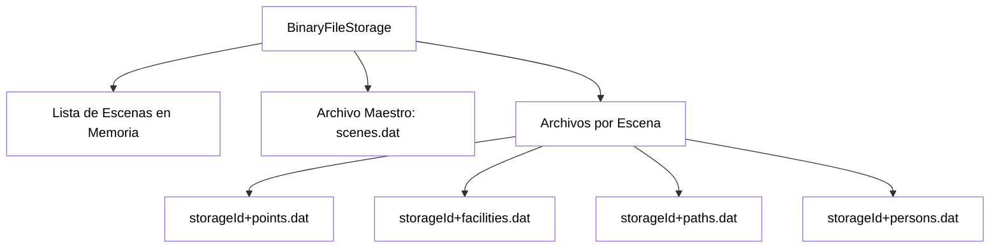
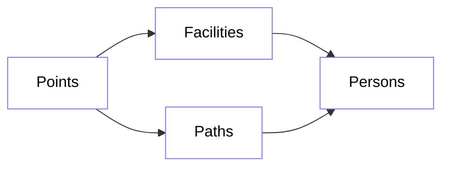

# Documentación del Sistema BinaryFileStorage

## Descripción General

`BinaryFileStorage` es un sistema de almacenamiento binario diseñado para persistir y cargar escenas de simulación. Gestiona archivos binarios para diferentes tipos de objetos simulados: **Points**, **Facilities**, **Paths** y **Persons**. Genera un archivo por cada tipo de objeto, asociados a la escena
a la que pertenecen.
Además, tiene un único archivo llamado scenes.dat que gestiona las distintas escenas.


## Serialización de strings (UTF8)

Todos los strings se guardan en UTF8 siguiendo el mismo formato:

1. (int): Tamaño en bytes que ocupa el string
2. (string): String en cuestión en bytes.


Aplicamos la misma fórmula para la carga:

1. (int): Tamaño en bytes que ocupa el string
2. Lectura con un buffer del tamaño de estos bytes
3. (string): String en cuestión en bytes.

## Arquitectura del Sistema



## Dependencias entre Entidades



## Métodos Principales

### Initialize()
Inicializa el sistema de almacenamiento. Crea `scenes.dat` si no existe y carga todos los IDs de escenas en memoria.

**Formato:**
```
[int: tamaño_id][string: storageId]...
```

### SaveScene(string storageId)
Guarda una escena completa creando/sobrescribiendo los archivos binarios correspondientes.

**Orden de guardado:** Points → Facilities → Paths → Persons → SceneId

### LoadScene(string storageId)
Carga una escena completa desde los archivos binarios.

**Orden de carga:** Points → Facilities → Paths → Persons

## Importante:
Hay que tener en cuenta las dependencias entre estas entidades ([ver dependencias](#dependencias-entre-entidades)), por eso se debe mantener el orden de guardado y cargado adecuado.


### DeleteScene(string storageId)
Elimina una escena del sistema.

**Orden de eliminación:** sceneId de la lista en memoria → Reescribir scenes.dat → Eliminar archivos asociados a la escena


## Estructura de Archivos

### 2. [storageId]points.dat
Almacena información de los puntos de la escena.

**Formato por punto:**
```
[int: tamaño_id]
[string: point_id]
[int: tamaño_nombre]
[string: nombre]
[float: posición_X]
[float: posición_Y]
[float: posición_Z]
```

### 3. [storageId]facilities.dat
Almacena información de las instalaciones.

**Formato por facility:**
```
[int: tamaño_id]
[string: facility_id]
[int: tamaño_nombre]
[string: nombre]
[float: power_consumed]
[int: num_entradas]
  └─ Por cada entrada:
     [int: tamaño_id_punto]
     [string: punto_id]
[int: num_salidas]
  └─ Por cada salida:
     [int: tamaño_id_punto]
     [string: punto_id]
```

### 4. [storageId]paths.dat
Almacena información de los caminos entre puntos.

**Formato por path:**
```
[int: tamaño_id]
[string: path_id]
[int: tamaño_nombre]
[string: nombre]
[int: capacity_persons]
[int: tamaño_id_punto1]
[string: point1_id]
[int: tamaño_id_punto2]
[string: point2_id]
```

### 5. [storageId]persons.dat
Almacena información de las personas en la simulación.

**Formato por persona:**
```
[int: tamaño_id]
[string: person_id]
[int: tamaño_nombre]
[string: nombre]
[int: edad]
[float: altura]
[float: peso]
[float: dinero]
[int: tamaño_id_facility]
[string: facility_id | "null"]
[int: tamaño_id_path]
[string: path_id | "null"]
```
**Importante:**
Tanto isAtFacility como isAtPath pueden ser null. Si es el caso, el sistema de guardado guarda la palabra "null" en el mismo formato que guardaría el Id, y el sistema de cargado cambia el valor "null" por null automáticamente.


## Consideraciones Importantes

Actualmente, el sistema solo soporta **una entrada y una salida** por Facility, aunque el formato de archivo permite múltiples entradas/salidas,
ya que el método constructor actual pide solo un punto de entrada y uno de salida pero los almacena en listas.
