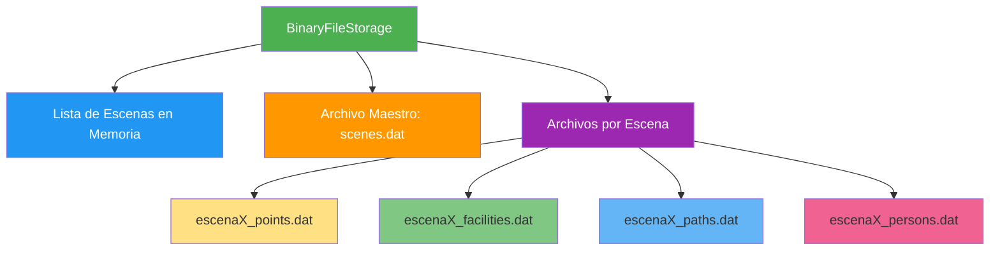
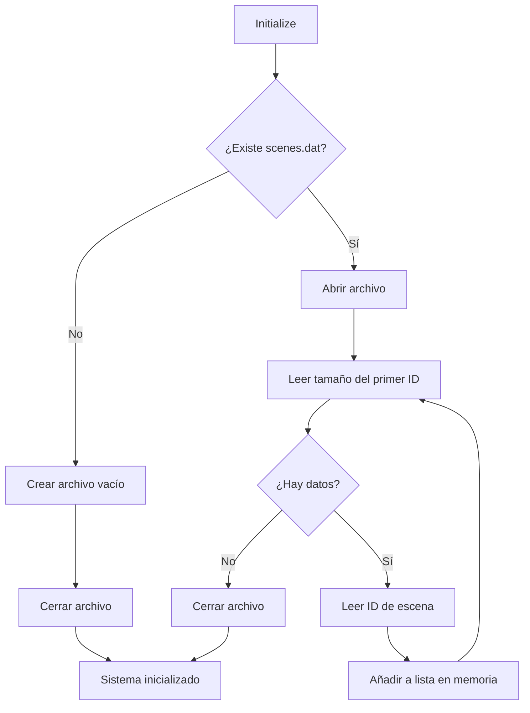
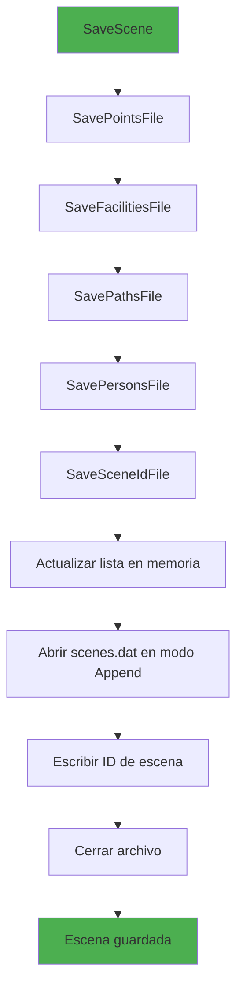
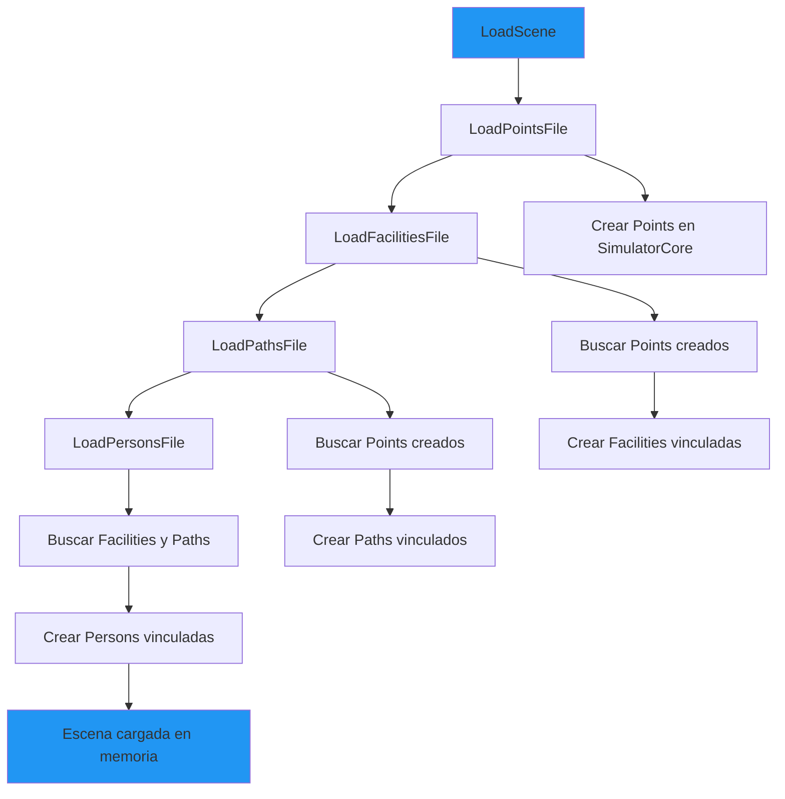
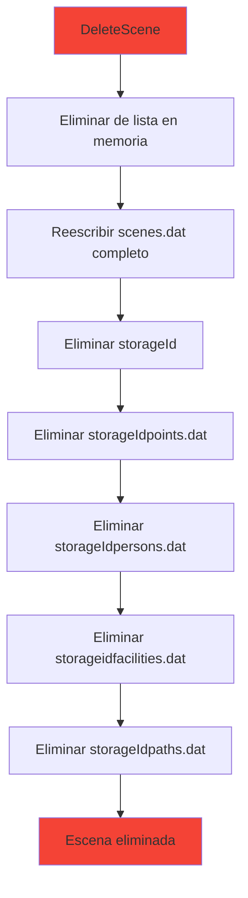
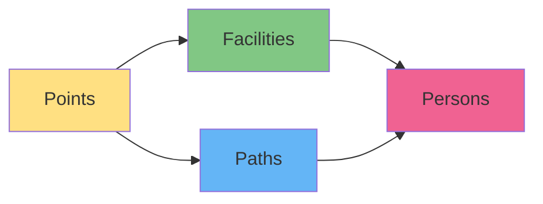

# Documentación del Sistema BinaryFileStorage

## Descripción General

`BinaryFileStorage` es un sistema de almacenamiento binario diseñado para persistir y cargar escenas de simulación. Gestiona archivos binarios para diferentes tipos de objetos simulados: **Points**, **Facilities**, **Paths** y **Persons**.

---

## Arquitectura del Sistema



## Estructura de Archivos

### 1. scenes.dat
Archivo maestro que contiene la lista de todas las escenas guardadas.

**Formato:**
```
[int: tamaño_id][string: scene_id]...
```

### 2. [escenaId]points.dat
Almacena información de los puntos de la escena.

**Formato por punto:**
```
[int: tamaño_id]
[string: point_id]
[int: tamaño_nombre]
[string: nombre]
[float: posición_X]
[float: posición_Y]
[float: posición_Z]
```

### 3. [escenaId]facilities.dat
Almacena información de las instalaciones.

**Formato por facility:**
```
[int: tamaño_id]
[string: facility_id]
[int: tamaño_nombre]
[string: nombre]
[float: power_consumed]
[int: num_entradas]
  └─ Por cada entrada:
     [int: tamaño_id_punto]
     [string: punto_id]
[int: num_salidas]
  └─ Por cada salida:
     [int: tamaño_id_punto]
     [string: punto_id]
```

### 4. [escenaId]paths.dat
Almacena información de los caminos entre puntos.

**Formato por path:**
```
[int: tamaño_id]
[string: path_id]
[int: tamaño_nombre]
[string: nombre]
[int: capacity_persons]
[int: tamaño_id_punto1]
[string: point1_id]
[int: tamaño_id_punto2]
[string: point2_id]
```

### 5. [escenaId]persons.dat
Almacena información de las personas en la simulación.

**Formato por persona:**
```
[int: tamaño_id]
[string: person_id]
[int: tamaño_nombre]
[string: nombre]
[int: edad]
[float: altura]
[float: peso]
[float: dinero]
[int: tamaño_id_facility]
[string: facility_id | "null"]
[int: tamaño_id_path]
[string: path_id | "null"]
```

## Flujo de Operaciones

### Inicialización del Sistema



### Guardar Escena



### Cargar Escena



### Eliminar Escena



## Dependencias entre Entidades



**Orden de carga:** Points → Facilities → Paths → Persons

**Orden de guardado:** Points → Facilities → Paths → Persons → SceneId

## Métodos Principales

### Initialize()
Inicializa el sistema de almacenamiento. Crea `scenes.dat` si no existe y carga todos los IDs de escenas en memoria.

### SaveScene(string storageId)
Guarda una escena completa creando/sobrescribiendo los archivos binarios correspondientes.

**Pasos:**
1. Guarda todos los Points
2. Guarda todas las Facilities
3. Guarda todos los Paths
4. Guarda todas las Persons
5. Registra el ID de la escena en scenes.dat

### LoadScene(string storageId)
Carga una escena completa desde los archivos binarios.

**Pasos:**
1. Carga Points (crea objetos Point)
2. Carga Facilities (requiere Points existentes)
3. Carga Paths (requiere Points existentes)
4. Carga Persons (requiere Facilities y Paths existentes)

### DeleteScene(string storageId)
Elimina una escena del sistema.

**Pasos:**
1. Elimina el ID de la lista en memoria
2. Reescribe scenes.dat sin el ID eliminado
3. Elimina todos los archivos asociados a la escena

### ListScenes()
Retorna la lista de IDs de todas las escenas guardadas.

## Consideraciones Importantes

### ⚠️ Manejo de Valores Nulos
Las referencias a Facilities y Paths en Persons pueden ser nulas. El sistema guarda la cadena `"null"` en UTF-8 cuando el valor es null.

### 🔗 Referencias entre Objetos
- **Facilities** referencian Points (entradas y salidas)
- **Paths** referencian dos Points (point1 y point2)
- **Persons** pueden referenciar una Facility y/o un Path

### 📝 Limitación Actual
Actualmente, el sistema solo soporta **una entrada y una salida** por Facility, aunque el formato de archivo permite múltiples entradas/salidas.

### 🔄 Orden de Carga Crítico
El orden de carga es fundamental debido a las dependencias. Los Points deben cargarse primero porque Facilities, Paths y Persons los referencian.

## Ejemplo de Uso

```csharp
// Inicializar el sistema
BinaryFileStorage storage = new BinaryFileStorage();
storage.Initialize();

// Guardar una escena
storage.SaveScene("escena01");

// Listar todas las escenas
List<string> scenes = storage.ListScenes();

// Cargar una escena
storage.LoadScene("escena01");

// Eliminar una escena
storage.DeleteScene("escena01");

// Finalizar
storage.Finish();
```

## Formato Binario General

Todos los archivos siguen un patrón similar:
1. **Tamaño del dato** (int de 4 bytes)
2. **Dato en sí** (string en UTF-8, int, o float)

Este patrón permite lectura secuencial y determinística de los datos.